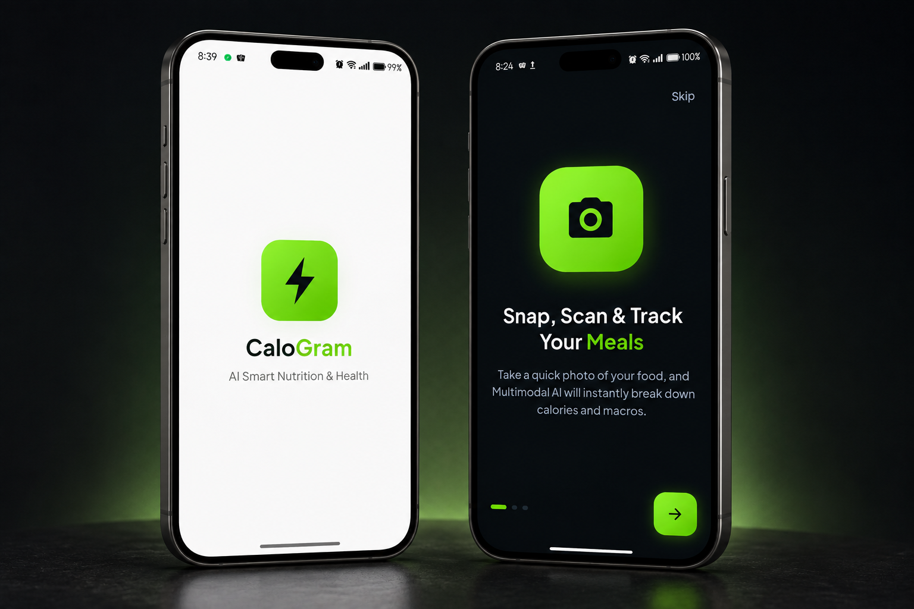
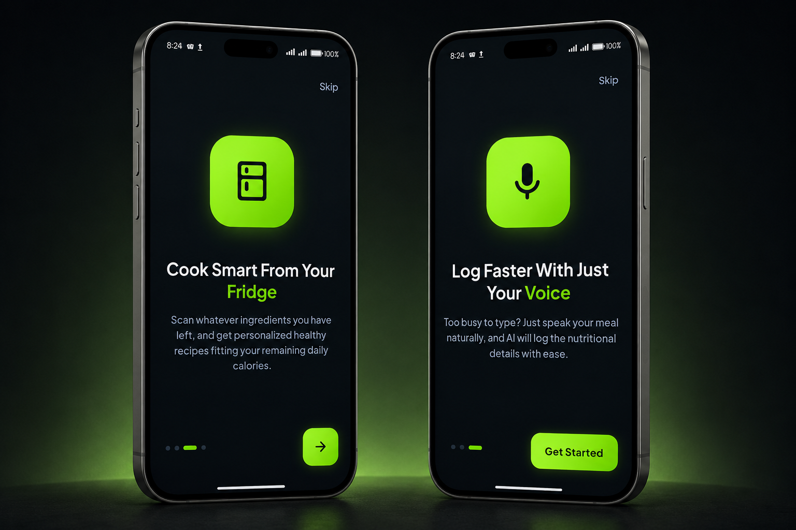
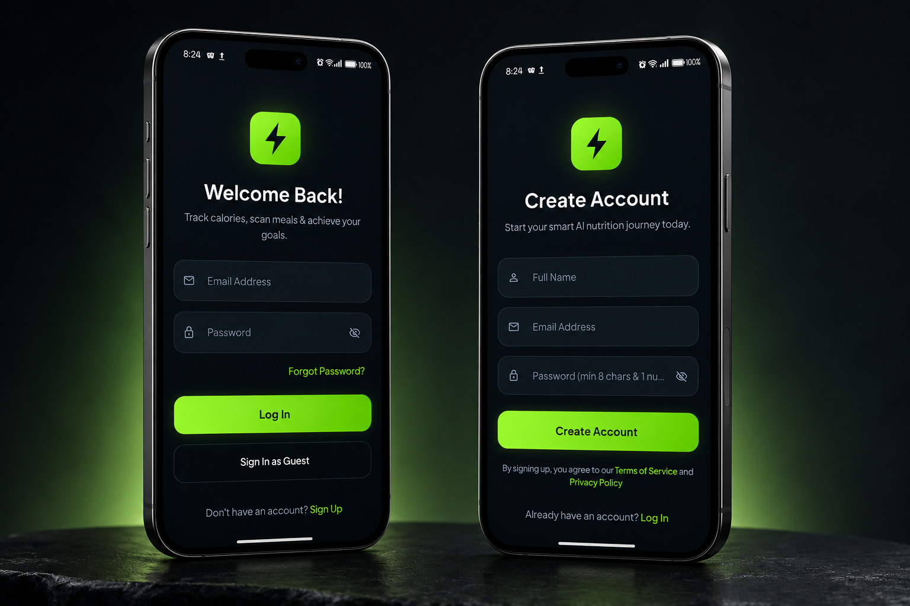
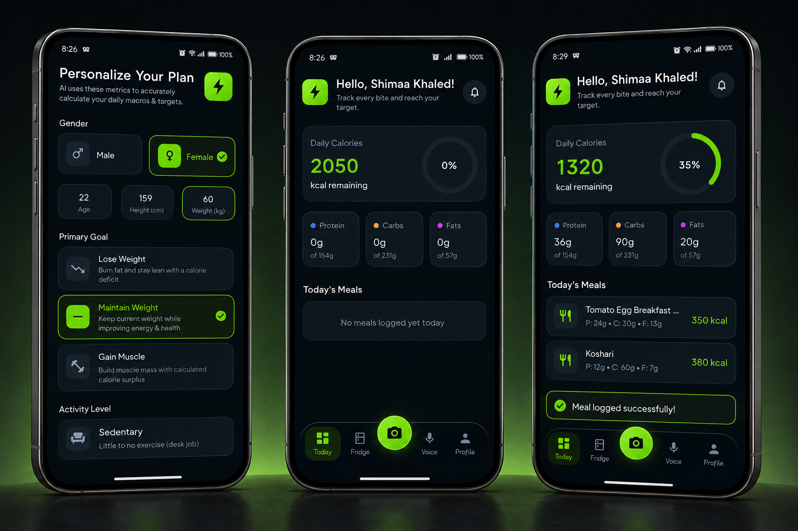
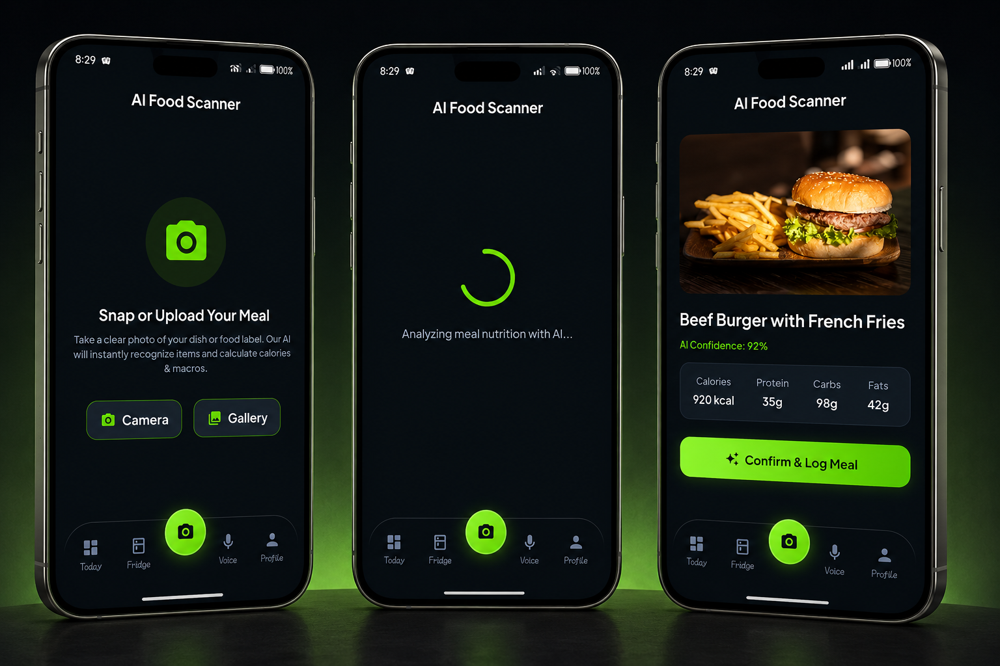
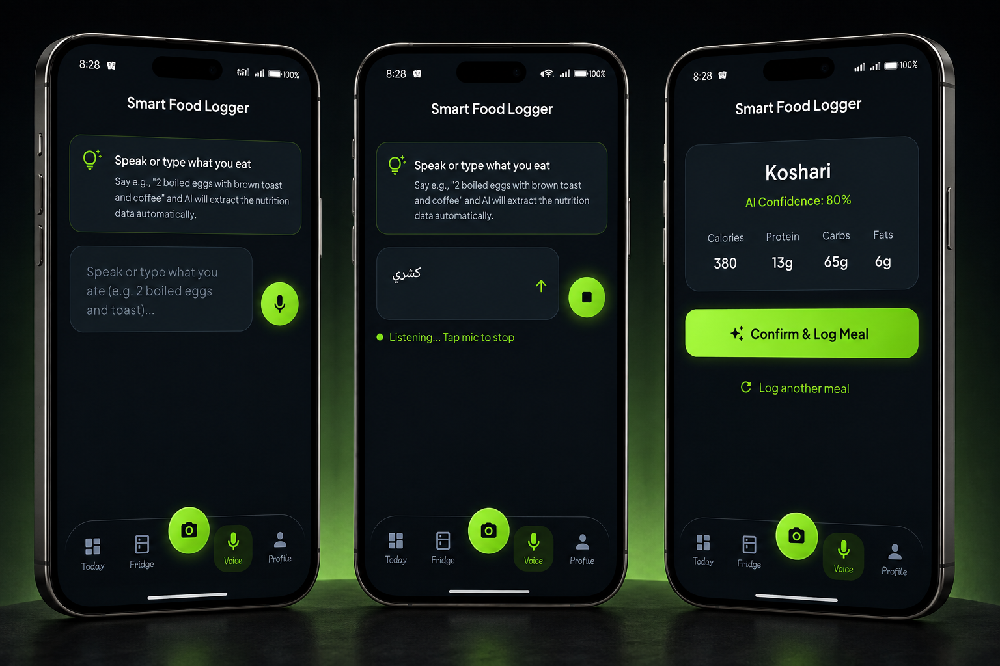
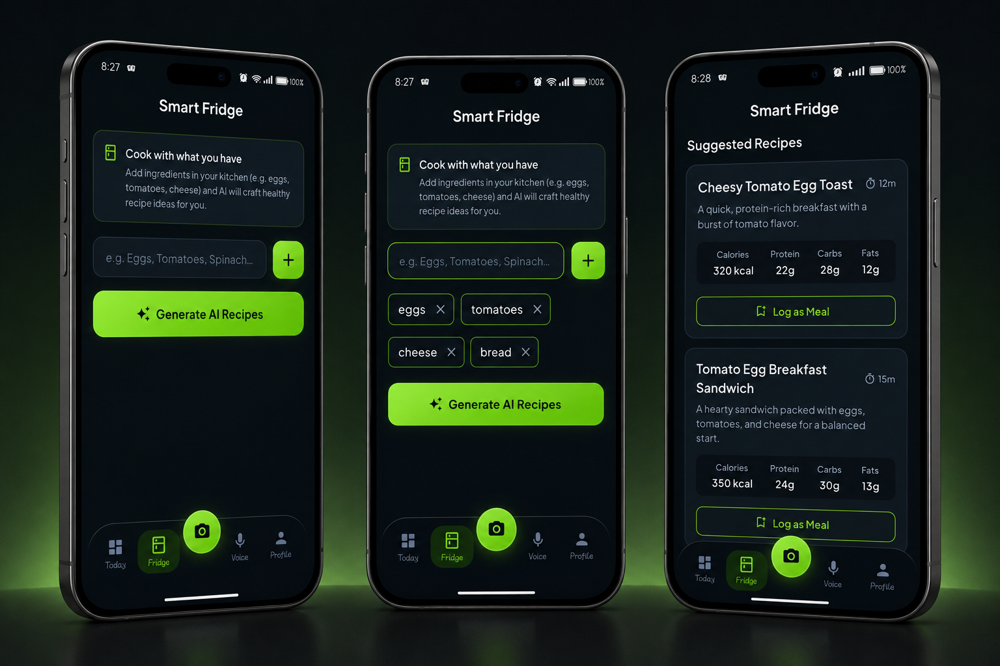
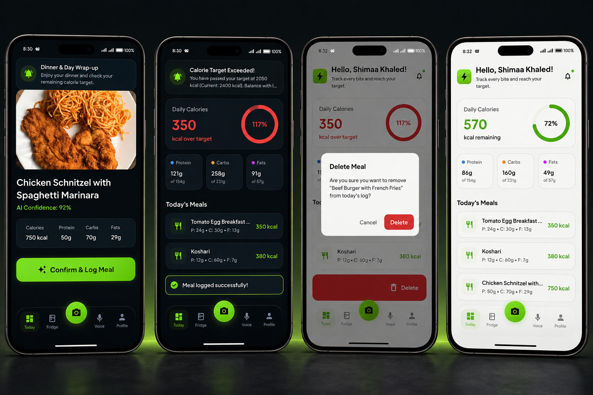
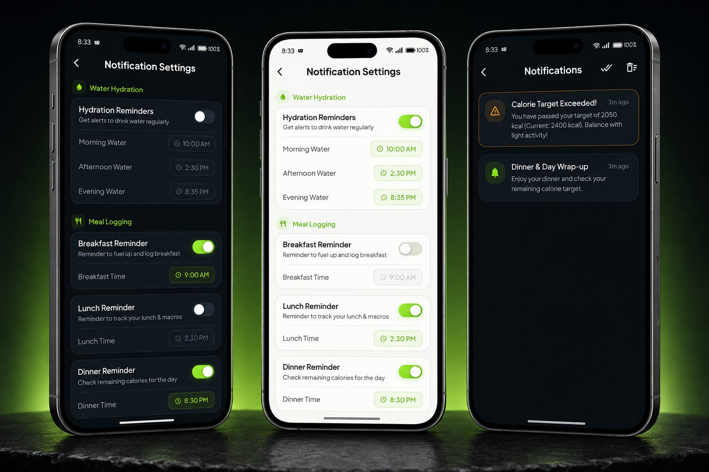
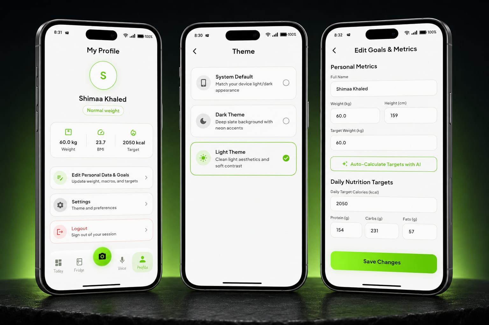

# CaloGram 🥗🤖

A cross-platform mobile application designed to simplify daily calorie tracking and promote healthy eating habits through advanced Multimodal Generative AI models. Built with Flutter following Clean Architecture and BLoC/Cubit state management principles, the app combines computer vision, natural speech processing, and local database caching with custom notification engines.

---

## 🤖 Dual AI Engine Architecture

CaloGram utilizes a hybrid AI architecture leveraging specialized inference pipelines for distinct core features:

- **Google Gemini AI (Vision):** Exclusively powers the Food Scanner to analyze meal images and nutritional labels, extracting precise calorie counts and macro distributions.
- **Groq Cloud (LPU Inference Engine):** Powers both the Voice Food Logger (for instant natural language parsing of voice and text logs) and the Smart Fridge (for ultra-fast dynamic recipe generation based on available ingredients).

---

## ✨ Key Features

- **📸 AI Food & Label Scanner (Powered by Gemini Vision):** Snap a dish or scan nutritional facts labels using the camera or gallery; automatically recognizes food items and calculates calories, protein, carbs, and fats.
- **🎙️ Voice Food Logger (Powered by Groq):** Log meals using spoken voice or natural text descriptions (e.g., "2 boiled eggs with brown toast and black coffee"); parses complex phrases into itemized food records with ultra-low latency.
- **🧊 Smart Fridge & Recipe Generator (Powered by Groq):** Enter available kitchen ingredients to generate customized, healthy, and calorie-conscious recipe ideas in milliseconds.
- **🔔 Intelligent Notification & Reminder System:**
  - **In-App Glassmorphic Alerts:** Interactive contextual banners with custom audio feedback for real-time foreground triggers.
  - **Zero-Cost Background Engine:** Battery-optimized exact alarm scheduling for hydration reminders and daily meal check-ins.
  - **Notification Center:** Local notification history log powered by Hive with automatic 7-day storage retention policies.
- **🎯 Daily Goals & Progress Tracking:** Real-time dashboard with dynamic progress indicators, BMI calculations, water intake tracking, and automatic calorie-target warnings.
- **🌓 Adaptive UI/UX:** Polished Dark and Light mode implementations with responsive layouts, smooth animations, and glassmorphic designs.

---

## 📸 Visual Showcase & App Flow

### 1. Onboarding & First Impression

  

  

### 2. Authentication & Personalization

  

  

### 3. Core Multimodal AI Features

  

  

  

### 4. Progress, Alerts & Theming

  

  

---

## 🏗️ Architecture & Project Structure

CaloGram is organized following Feature-First Clean Architecture principles to ensure maintainability, scalability, and testability:

lib/
├── core/
│   ├── constants/          # App-wide constants & keys
│   ├── router/             # GoRouter navigation setup
│   ├── services/           # Notification, Storage, DI, Cache services
│   ├── theme/              # Typography, Color palettes & App themes
│   └── widgets/            # Reusable UI components & dialogs
└── features/
    ├── data/
    │   ├── datasources/    # Remote AI clients & Local Hive DB
    │   ├── models/         # JSON serializable data models & Hive adapters
    │   └── repos/          # Repository implementations
    ├── domain/
    │   ├── entities/       # Core business entities
    │   ├── repos/          # Abstract repository interfaces
    │   └── usecases/       # Application business logic & use cases
    └── presentation/
        ├── manager/        # BLoC / Cubit state management
        └── views/          # Screen UI views, tabs, and widgets

---

## 🛠️ Tech Stack & Libraries

- **Framework:** Flutter (Dart 3+)
- **Architecture & State Management:** `flutter_bloc`, `bloc`, `dartz`, `equatable`
- **Dependency Injection:** `get_it`
- **Backend & Cloud:** `firebase_core`, `firebase_auth`, `cloud_firestore`
- **AI Integrations:** Google Gemini API & Groq Cloud API (`http`, `flutter_dotenv`)
- **Local Storage & Caching:** `hive_flutter`, `shared_preferences`
- **Routing & Navigation:** `go_router`
- **Notifications & Audio:** `flutter_local_notifications`, `flutter_timezone`, `audioplayers`
- **Hardware & Inputs:** `image_picker`, `speech_to_text`, `permission_handler`
- **UI & Styling:** `google_fonts`, `flutter_svg`, `device_preview`

---

## 🚀 Getting Started

### Prerequisites
- Flutter SDK (>= 3.0.0)
- Dart SDK
- Android Studio / VS Code
- Git

### Installation & Setup

1. **Clone the repository:**
   git clone [https://github.com/shimaakhaled1410/calogram.git](https://github.com/shimaakhaled1410/calogram.git)
   cd calogram

2. **Configure API Keys:**
   Create a `.env` file in the root directory and add your API credentials:
   GEMINI_API_KEY=your_gemini_api_key_here
   GROQ_API_KEY=your_groq_api_key_here

3. **Install dependencies:**
   flutter pub get

4. **Run code generation (for Hive adapters & models):**
   dart run build_runner build --delete-conflicting-outputs

5. **Run the application:**
   flutter run